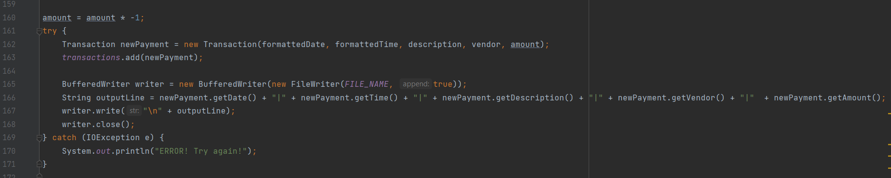

# Accounting Ledger Application

### This is my Capstone1

This application is an accounting application that securely allows users to track and filter through their financial activity. This would include payment and deposits.

Interesting code:
This code is interesting bc it mentally challenged me. And I thought it was cool to learn the code that apps we use everyday keep up with our transactions.

## Features:
- Records Transactions
- Records Payments
- View Ledger of All Payments
- View Ledger oof All Deposits
- View ledger of All Transactions
- Filter By Year to Date
- Filter By Month To Date
- Filter By Previous Month

#### How To:

- Clone or download this repository to your local device.

- Compile and run FinancialTracker.java
- 

-----------------------------------

# Home Menu (Options)
#### Add Deposit:
Select option 'D' to add a deposit. Then enter the date, time, description, vendor & amount.

----------------------------------

#### Make Payment (Debit):
Select option 'P' to make a payment. Then enter the date, time, description, vendor & amount into system.

--------------------------------
#### Ledger:
Select the 'L' option to access the ledger. This will show you all of the overall reports.

## Future work: 
- The ability to show pending deposits. 
- And the ability to remove any incorrect transaction.

# Thanks: 
Special thanks to Raymond, Ceren & Jaheim for helping me connect the dots on this project.
Raymond for his guidance and patience. He was only available for a limited amount of time & yet
\made a huge impact. I also want to thank Jaheim & Ceren for their allowing me to bounce my ideas off of them
and for also providing priceless feedback dring this process.

